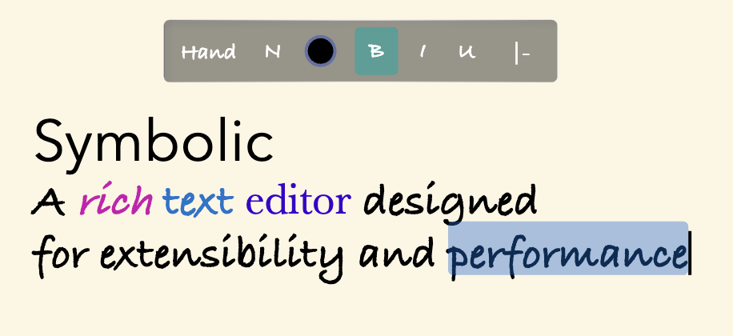

# Symbolic
A graphical rich text editor designed for extensibility and performance

# Features
- rich text format
- word wrapping
- editing
- events based
- context menu
- latex (TODO)
- command palatte (TODO)  
- dynamic wrapping (TODO)

# Philosophy
- make sure that the code is HTML canvas independent
- code should be easy to understand and organised
- design for collaboration, mouse, and touch devices
- minimalistic, consistent
- attention to detail
- everything is a vector
- everything should be animatable
- invention of dreams!

# Contribute
If you'd like to contribute reach out to me on my email -> manikraina1096@gmail.com
